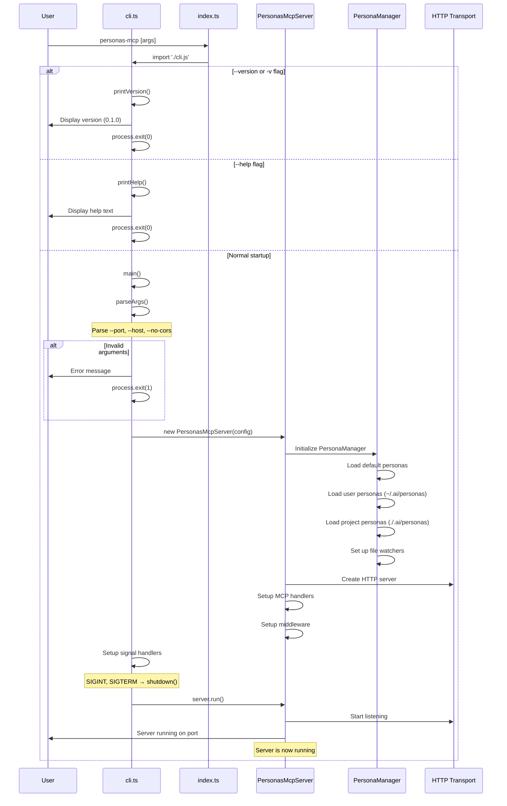
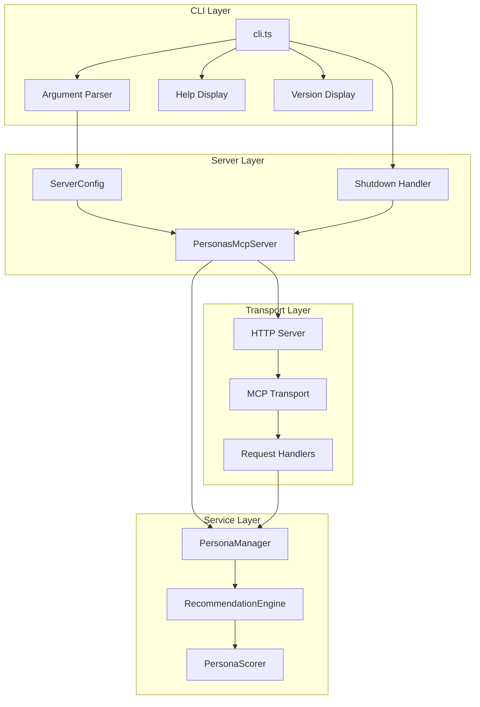
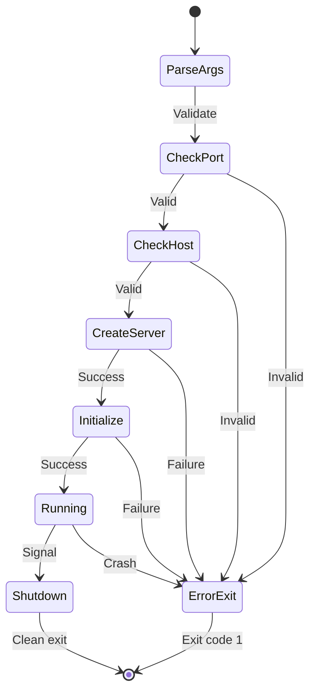

# CLI Startup Flow Architecture

This document describes the startup flow of the personas-mcp CLI, including command-line argument handling and server initialization.

## Overview

The CLI provides a command-line interface for the Personas MCP server with support for various options including help, version, and server configuration.

## Startup Sequence



## CLI Logic Flow

```mermaid
flowchart TD
    Start([personas-mcp command]) --> Import[Import cli.js]

    Import --> CheckVersion{--version or -v?}
    CheckVersion -->|Yes| ShowVersion[Display version]
    ShowVersion --> Exit1([Exit 0])

    CheckVersion -->|No| CheckHelp{--help?}
    CheckHelp -->|Yes| ShowHelp[Display help]
    ShowHelp --> Exit2([Exit 0])

    CheckHelp -->|No| Main[Call main()]
    Main --> ParseArgs[Parse arguments]

    ParseArgs --> ValidatePort{Valid port?}
    ValidatePort -->|No| ErrorPort[Error: Invalid port]
    ErrorPort --> Exit3([Exit 1])

    ValidatePort -->|Yes| ValidateHost{Valid host?}
    ValidateHost -->|No| ErrorHost[Error: Host required]
    ErrorHost --> Exit4([Exit 1])

    ValidateHost -->|Yes| CreateServer[Create PersonasMcpServer]
    CreateServer --> InitPM[Initialize PersonaManager]
    InitPM --> LoadPersonas[Load personas]
    LoadPersonas --> SetupHandlers[Setup signal handlers]
    SetupHandlers --> RunServer[Run server]

    RunServer --> ServerError{Server error?}
    ServerError -->|Yes| LogError[Log error]
    LogError --> Exit5([Exit 1])

    ServerError -->|No| Running[Server running]

    Running --> Signal{Receive signal?}
    Signal -->|SIGINT/SIGTERM| Shutdown[Graceful shutdown]
    Shutdown --> Exit6([Exit 0])
    Signal -->|No| Running
```

## Component Interactions During Startup



## Error Handling Flow



## Key Design Decisions

1. **Early Flag Handling**: Version and help flags are checked before any server initialization to provide quick responses without unnecessary resource allocation.

2. **Graceful Shutdown**: Signal handlers ensure clean shutdown of all resources including file watchers and HTTP connections.

3. **Configuration Validation**: Arguments are validated early to fail fast with clear error messages.

4. **Modular Structure**: Clear separation between CLI handling, server initialization, and service components.

## Testing Considerations

The CLI can be tested at multiple levels:

1. **Unit Tests**: Test individual functions like `parseArgs()`, `printHelp()`, `printVersion()`
2. **Integration Tests**: Test full startup flow with various argument combinations
3. **E2E Tests**: Test actual server startup and shutdown scenarios

## Security Considerations

- Host validation prevents binding to unauthorized interfaces
- Port validation ensures only valid port numbers are accepted
- No sensitive information is logged during startup
- Graceful shutdown prevents resource leaks
