# MCP Server Architecture

## Overview

The MCP Server component implements the Model Context Protocol, providing HTTP transport, request routing, and integration with persona services. It serves as the entry point for all client interactions.

## Server Architecture

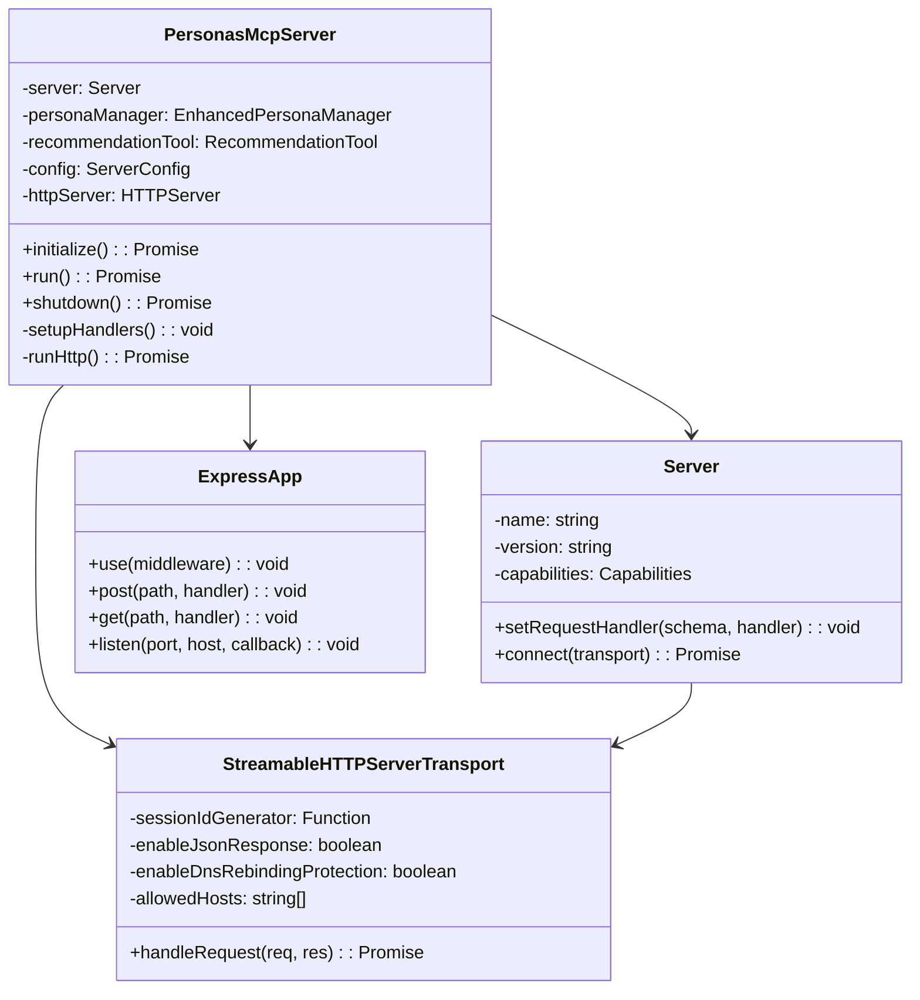

## Request Flow

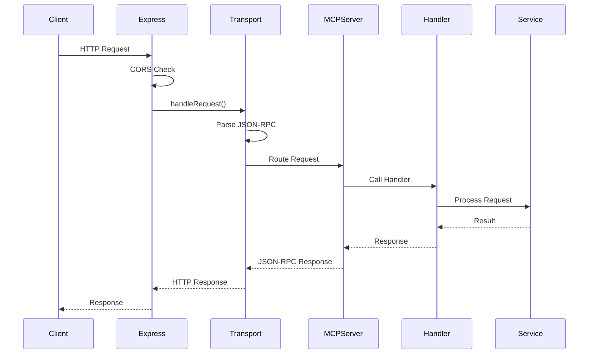

## HTTP Layer

### Express Configuration

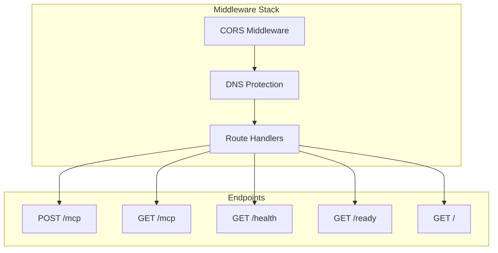

### CORS Configuration

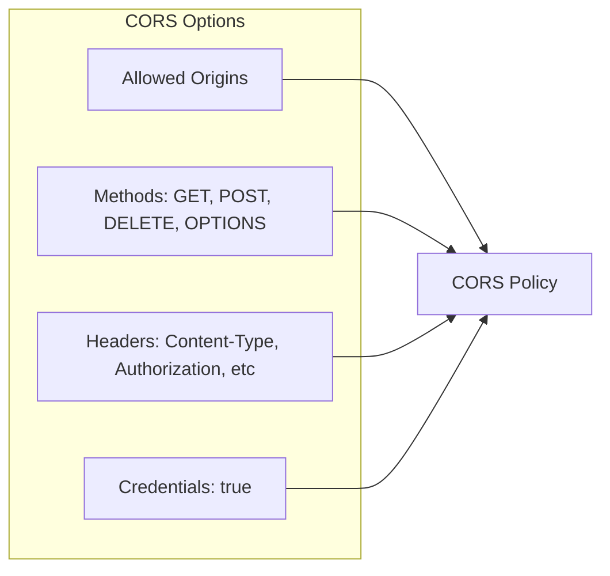

## MCP Protocol Implementation

### Request Handlers

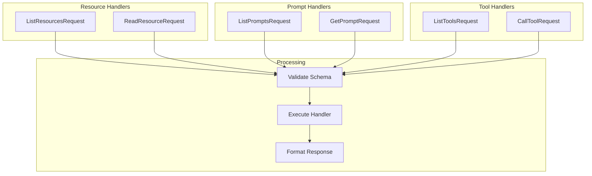

### Capability Registration

```mermaid
graph TB
    subgraph "Server Capabilities"
        Resources[resources: {}]
        Prompts[prompts: {}]
        Tools[tools: {}]
    end

    subgraph "Handler Registration"
        RH[Resource Handlers]
        PH[Prompt Handlers]
        TH[Tool Handlers]
    end

    Resources --> RH
    Prompts --> PH
    Tools --> TH
```

## Transport Layer

### StreamableHTTP Transport

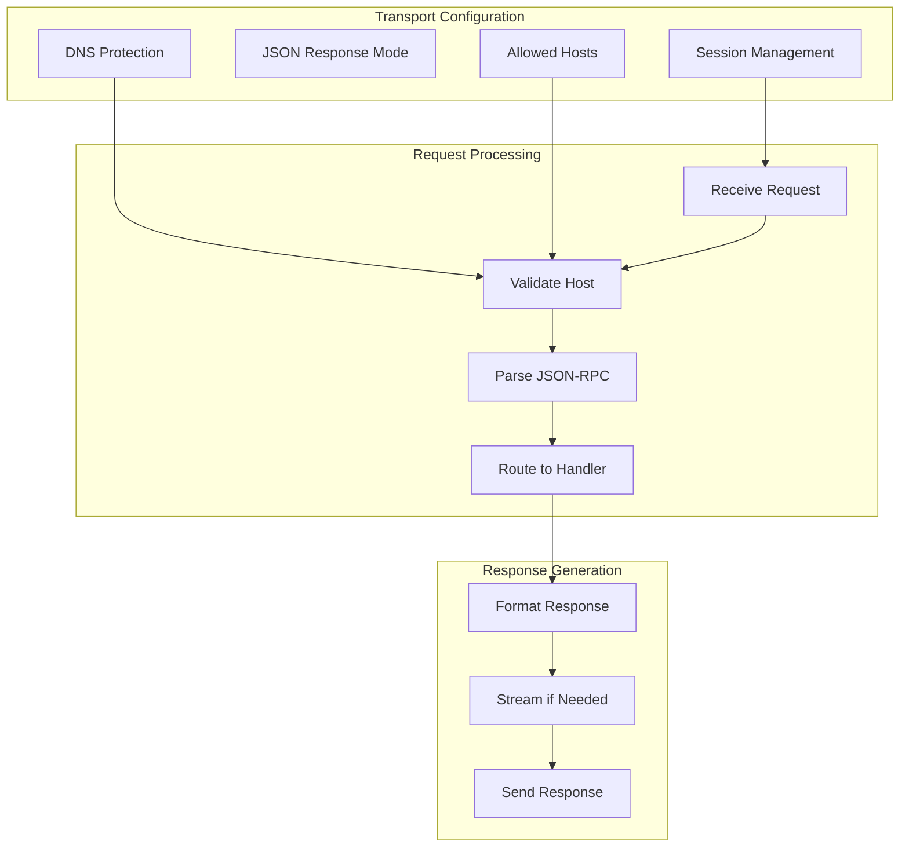

## Session Management

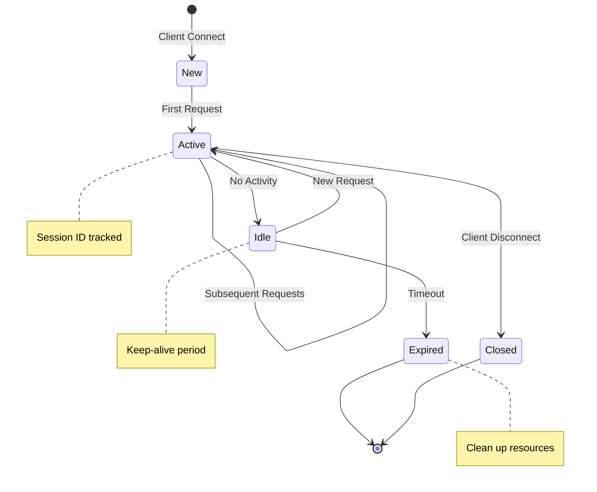

## Error Handling

### Error Flow

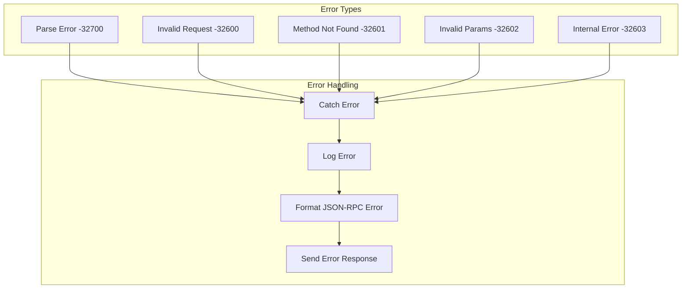

### Error Response Format

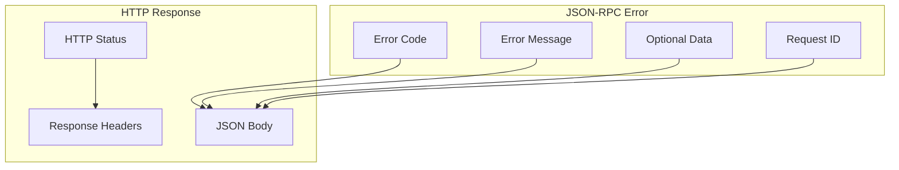

## Health Monitoring

### Health Check System

```mermaid
graph TB
    subgraph "Health Endpoints"
        Health[/health]
        Ready[/ready]
        Info[/]
    end

    subgraph "Health Checks"
        Server[Server Status]
        Personas[Persona Status]
        Memory[Memory Usage]
        Uptime[Uptime]
    end

    subgraph "Status Response"
        Status[Overall Status]
        Details[Component Details]
        Metrics[Metrics]
    end

    Health --> Server
    Health --> Personas
    Ready --> Server
    Info --> Memory
    Info --> Uptime

    Server --> Status
    Personas --> Details
    Memory --> Metrics
    Uptime --> Metrics
```

## Security Architecture

### Security Layers

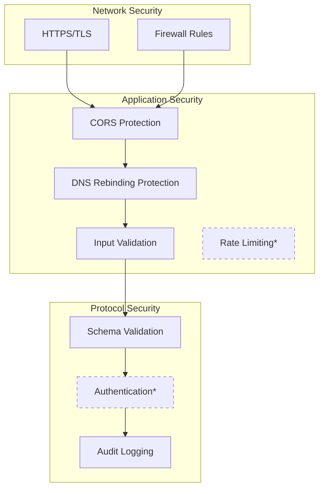

\*Future enhancements

## Performance Optimization

### Request Pipeline

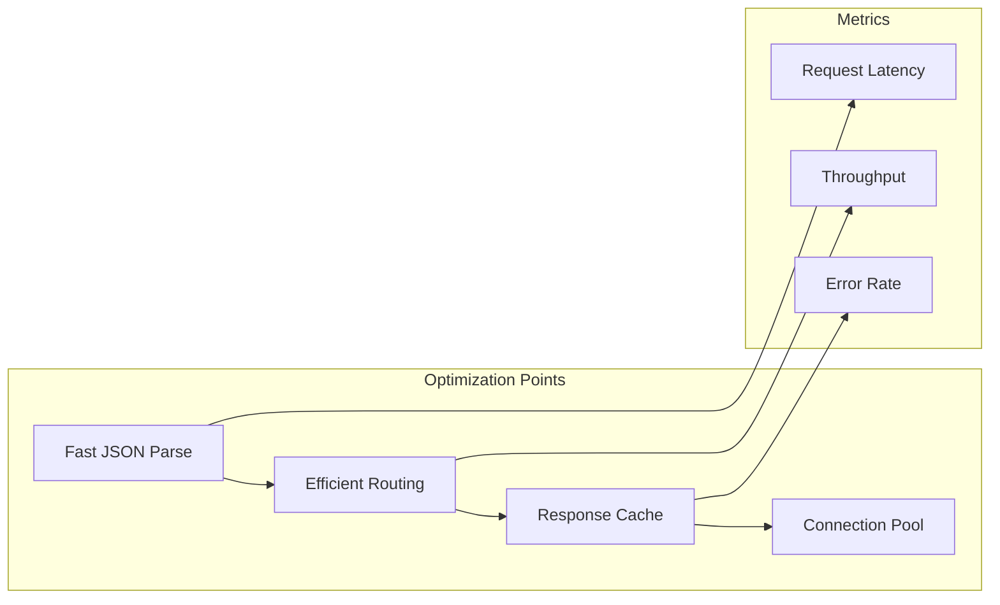

## Configuration

### Server Configuration

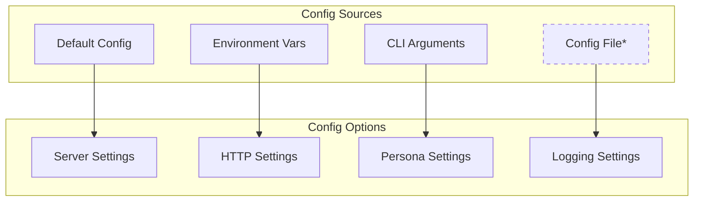

### Environment Variables

- `PORT`: Server port (default: 3000)
- `HOST`: Server host (default: localhost)
- `CORS_ENABLED`: Enable CORS (default: true)
- `LOG_LEVEL`: Logging level
- `MCP_ENDPOINT`: MCP endpoint path

## Deployment Architecture

### Production Deployment

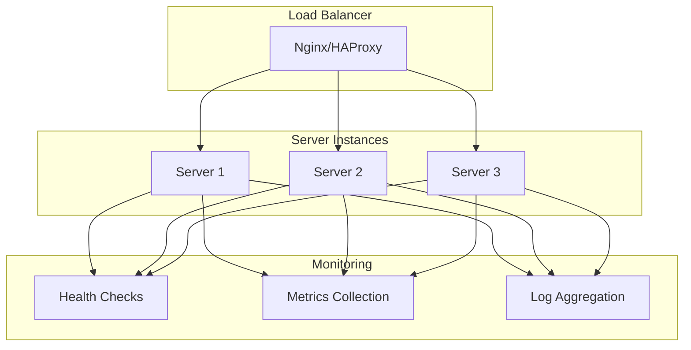

## Future Enhancements

1. **WebSocket Support**: Real-time bidirectional communication
2. **Authentication**: OAuth2/JWT authentication
3. **Rate Limiting**: Protect against abuse
4. **Metrics Export**: Prometheus/OpenTelemetry
5. **Clustering**: Multi-process support
