# Persona Manager Architecture

## Overview

The Enhanced Persona Manager is the core component responsible for loading, managing, and providing access to personas. It supports multiple persona sources with precedence rules and hot-reloading capabilities.

## Component Architecture

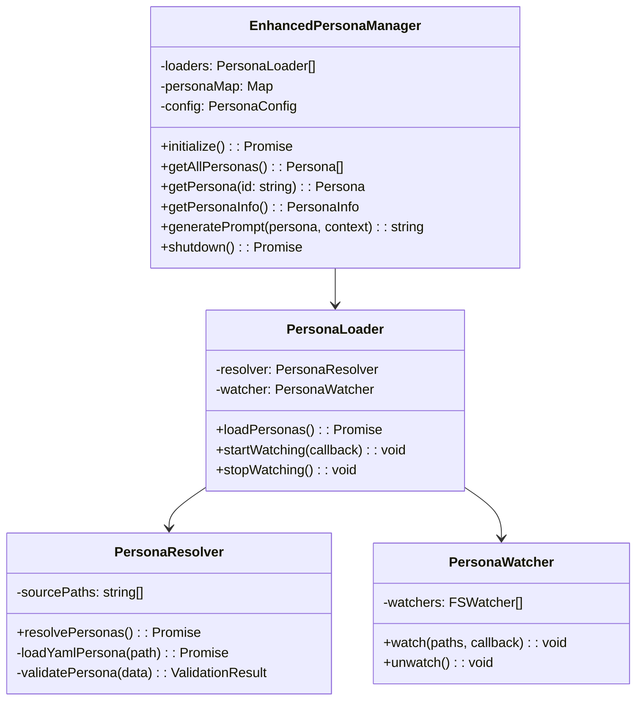

## Data Flow

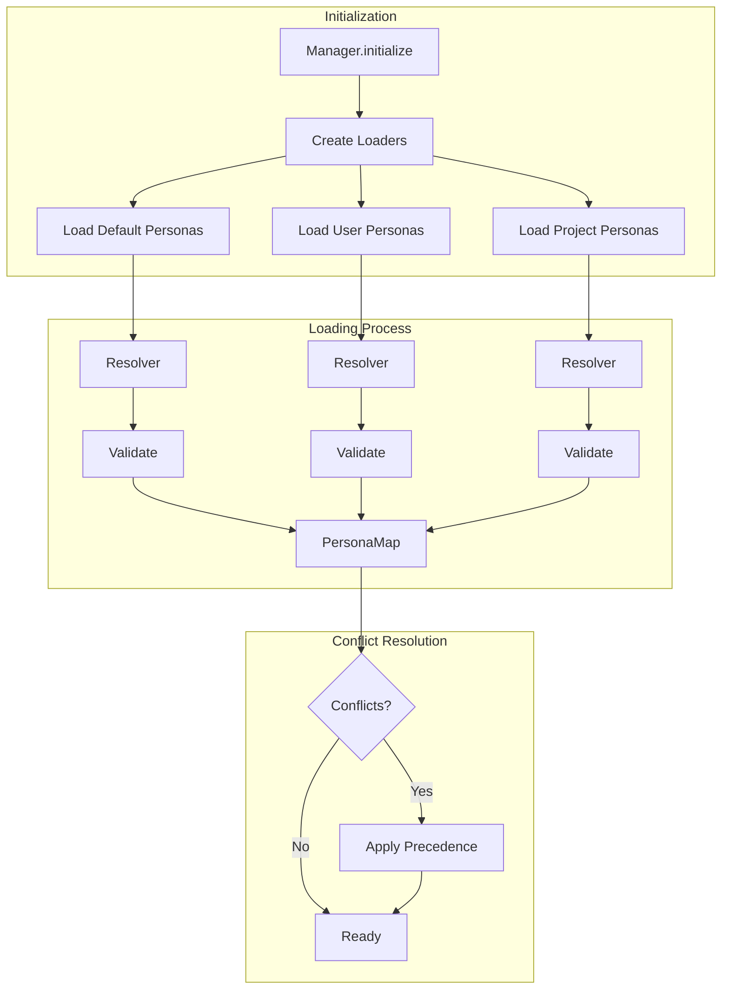

## Persona Loading Strategy

### Source Precedence
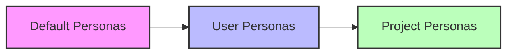

**Precedence Rules**:
1. Project personas (highest priority)
2. User personas
3. Default personas (lowest priority)

### Loading Sequence

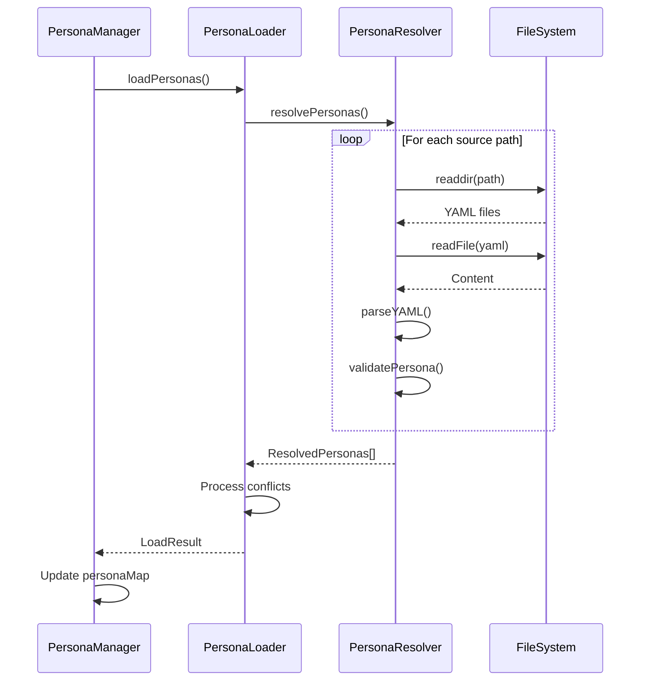

## State Management

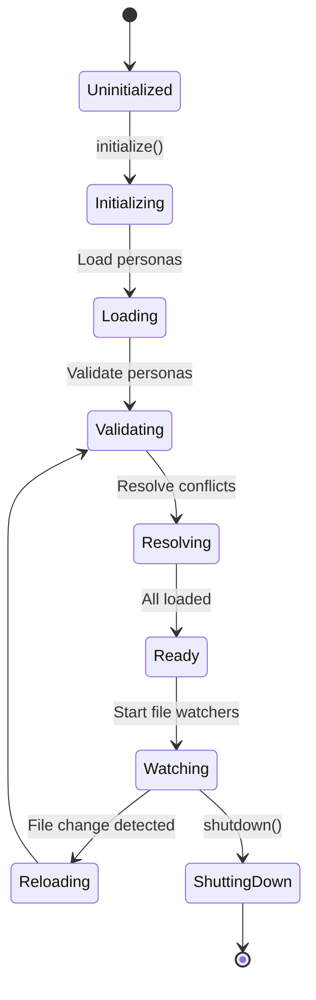

## File Watching Architecture

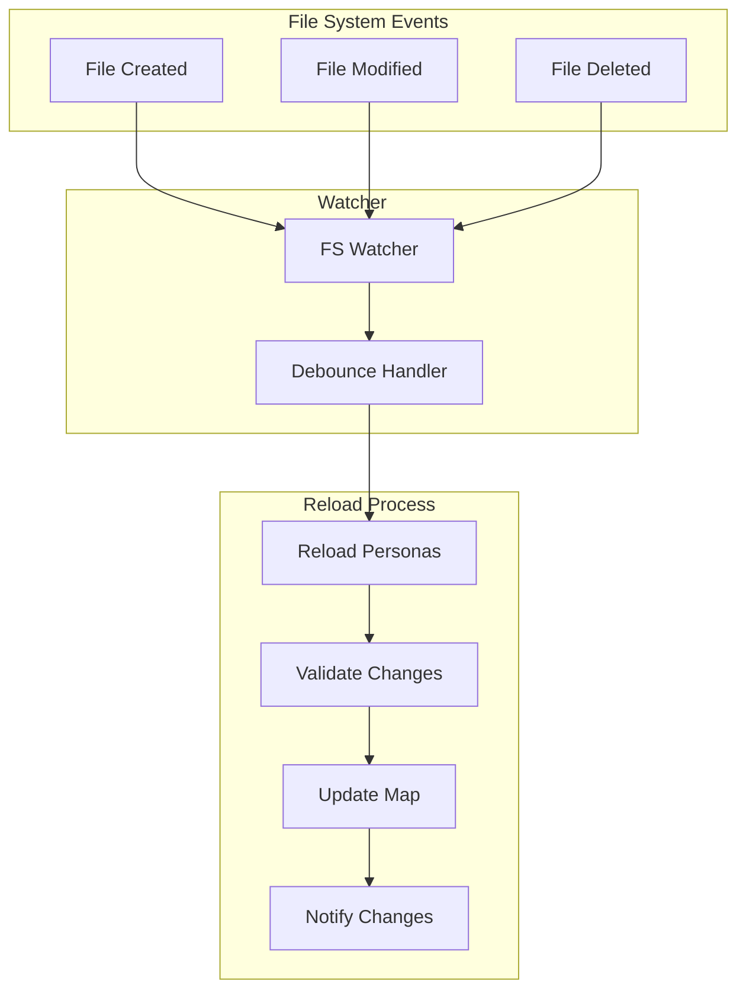

## Data Structures

### Persona Map Structure
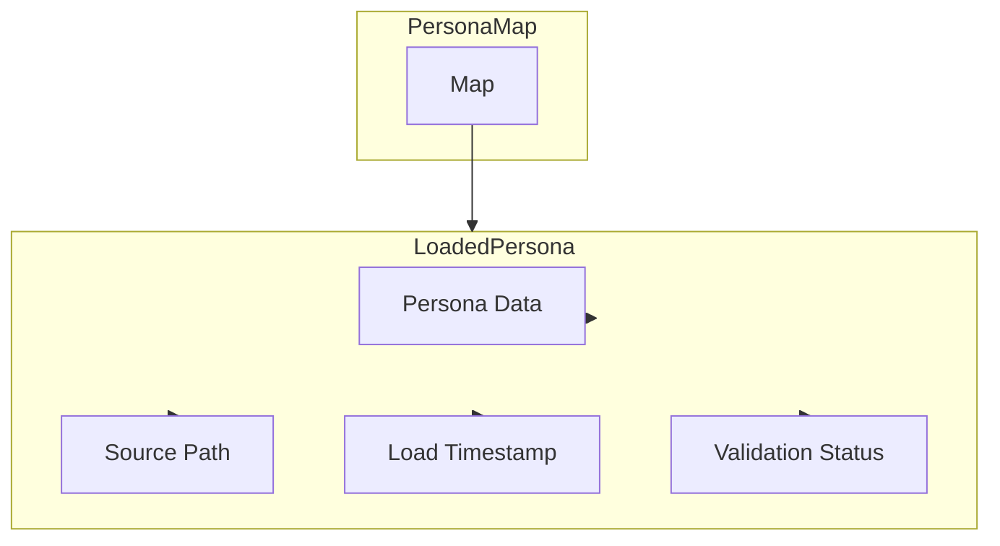

### Validation Flow
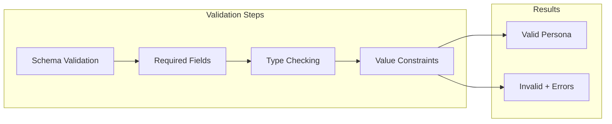

## Error Handling

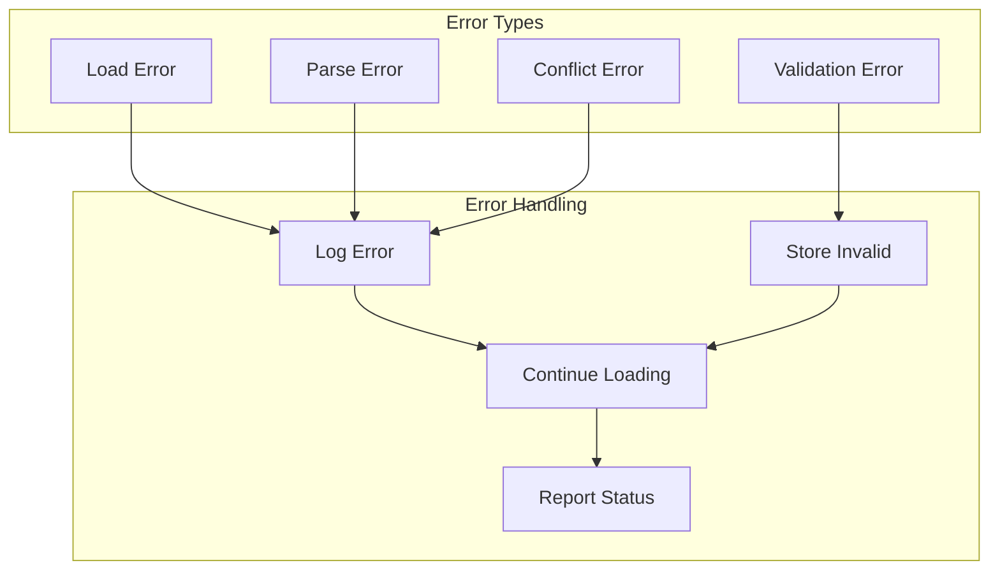

## Performance Optimizations

### Caching Strategy
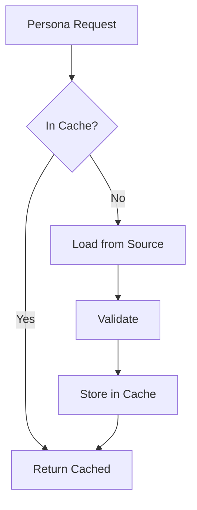

### Lazy Loading
```mermaid
graph LR
    GetPersona[getPersona(id)] --> Check{Loaded?}
    Check -->|Yes| Return[Return Persona]
    Check -->|No| LoadSingle[Load Single Persona]
    LoadSingle --> Cache[Cache Result]
    Cache --> Return
```

## Integration Points

### With Recommendation Engine
```mermaid
graph TB
    RE[RecommendationEngine] --> PM[PersonaManager]
    PM --> GetAll[getAllPersonas()]
    PM --> GetOne[getPersona(id)]
    GetAll --> Personas[Persona Array]
    GetOne --> Persona[Single Persona]
    Personas --> RE
    Persona --> RE
```

### With MCP Server
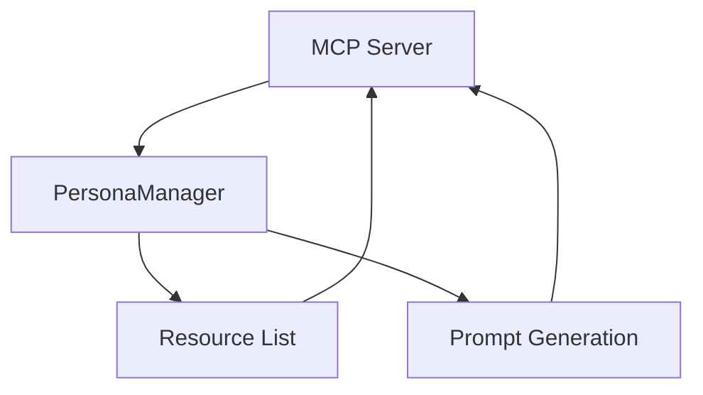

## Configuration

### Default Configuration
```typescript
interface PersonaConfig {
  defaultPersonasPath: string;
  userPersonasPath: string;
  projectPersonasPath: string;
  watchForChanges: boolean;
  validationMode: 'strict' | 'loose';
  conflictResolution: 'override' | 'merge';
}
```

### Environment Variables
- `PERSONAS_PATH`: Override default paths
- `PERSONAS_WATCH`: Enable/disable watching
- `PERSONAS_VALIDATION`: Validation mode

## Future Enhancements

1. **Database Backend**: Store personas in database
2. **Remote Loading**: Load personas from URLs
3. **Versioning**: Support persona versions
4. **Caching Layer**: Redis/Memcached integration
5. **Event System**: Emit events on changes