# Recommendation Engine Architecture

## Overview

The Recommendation Engine is responsible for analyzing tasks and recommending the most suitable personas based on multi-factor scoring. It provides intelligent matching, comparison, and contextual recommendations.

## Component Architecture

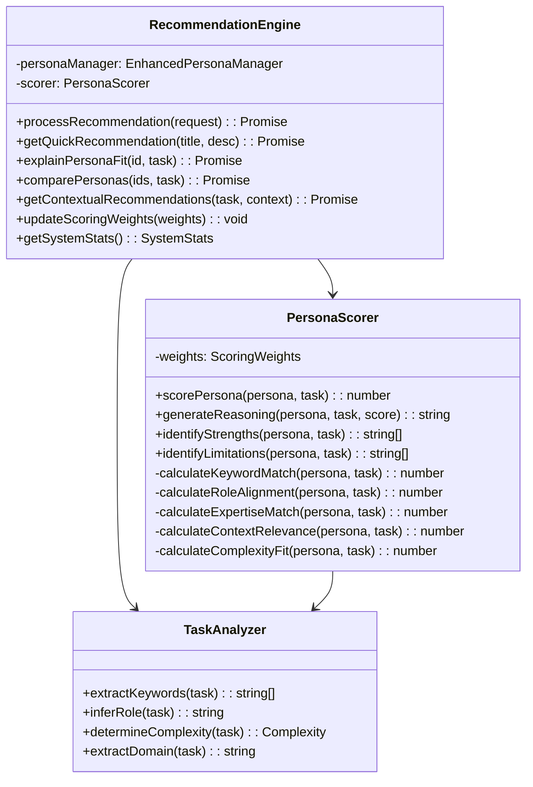

## Request Processing Flow

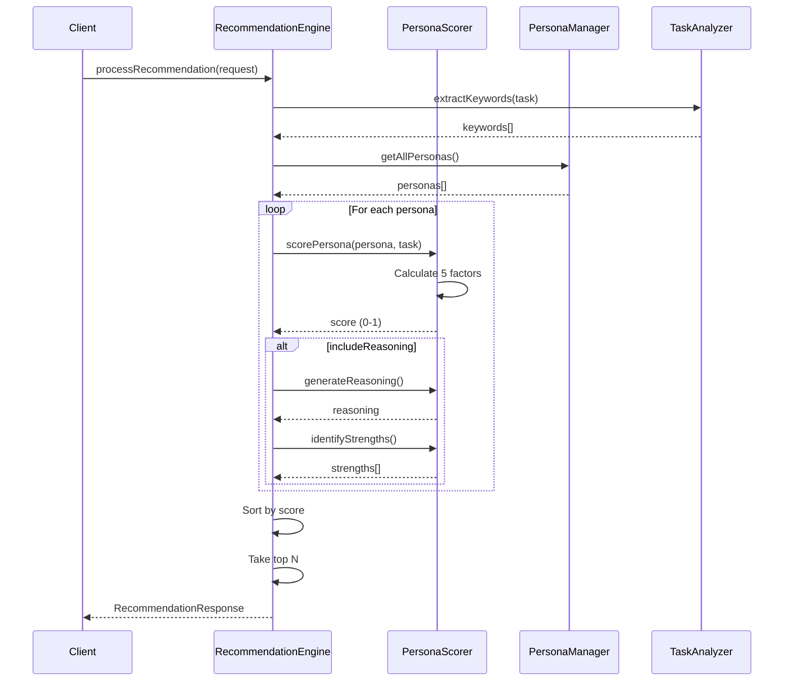

## Scoring Architecture

### Multi-Factor Scoring System

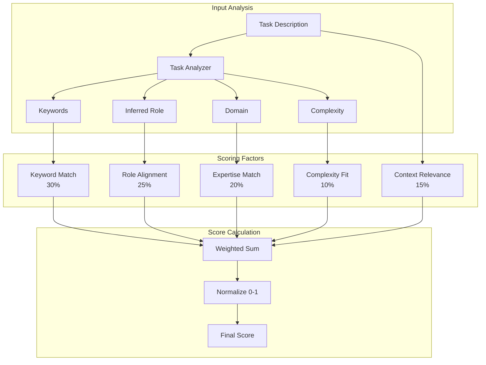

### Scoring Pipeline

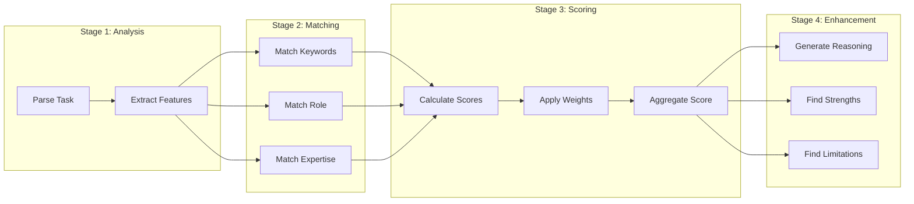

## Algorithm Details

### Keyword Matching Algorithm

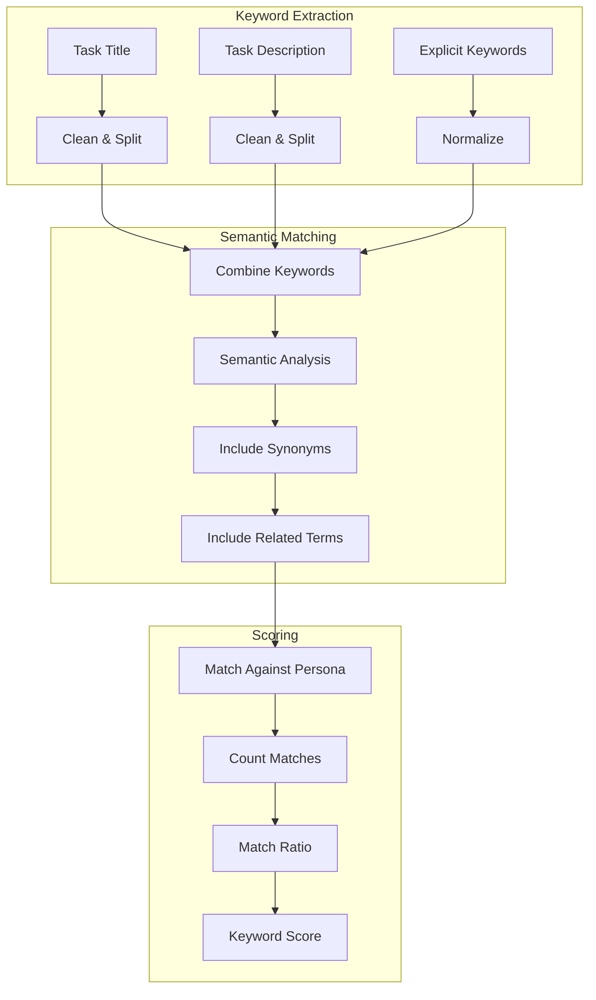

### Role Alignment Matrix

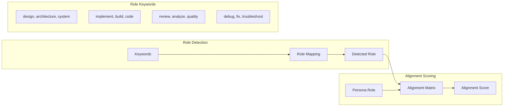

## Contextual Recommendations

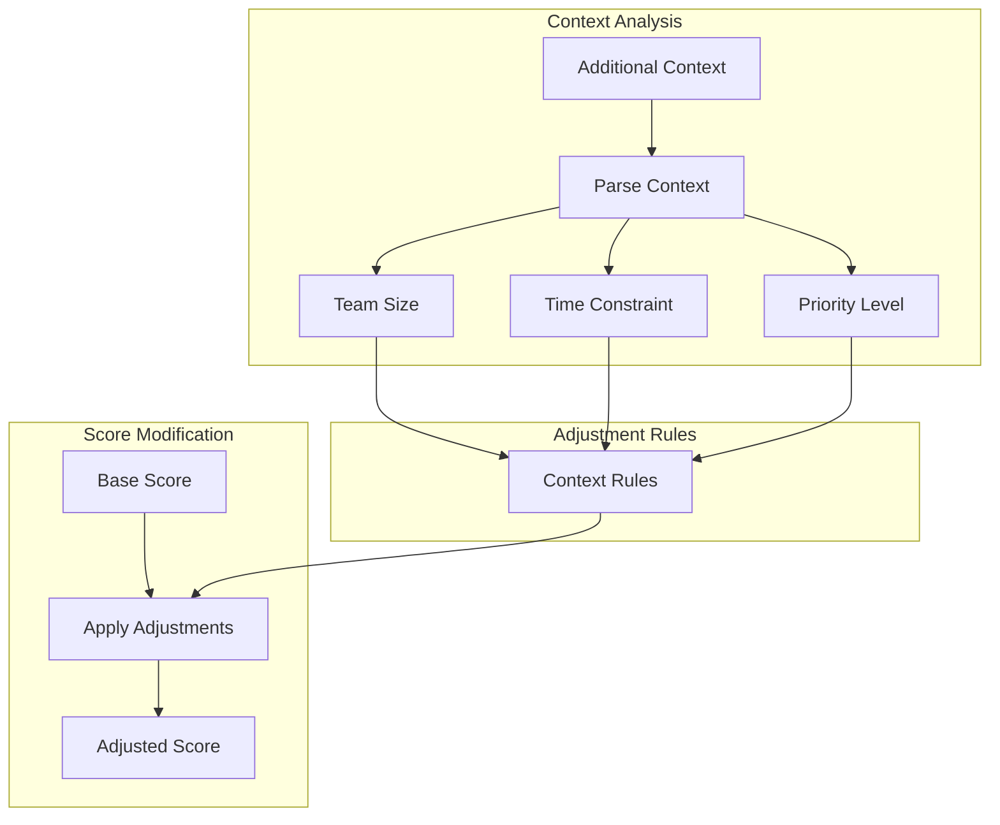

## Caching Strategy

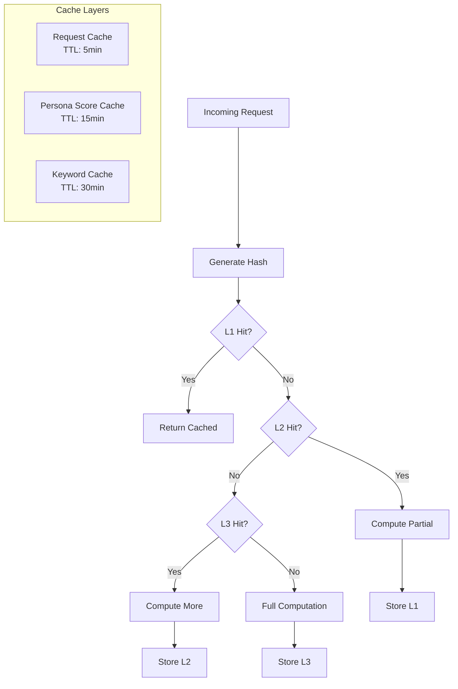

## Performance Optimization

### Parallel Processing

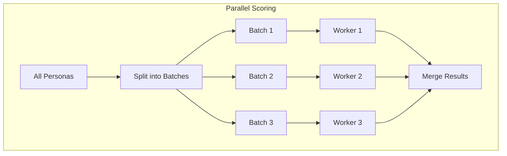

### Early Termination

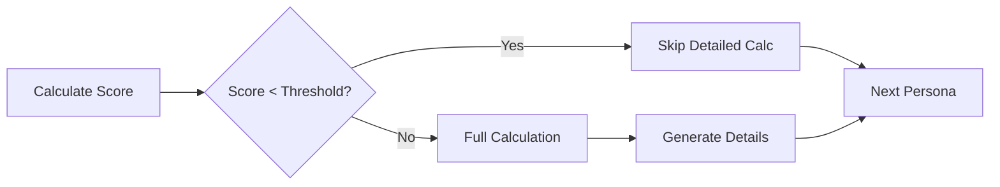

## Error Handling

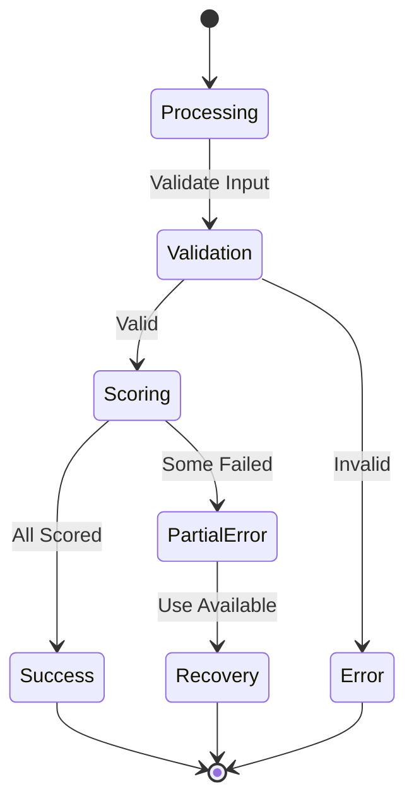

## Metrics and Analytics

### Performance Metrics

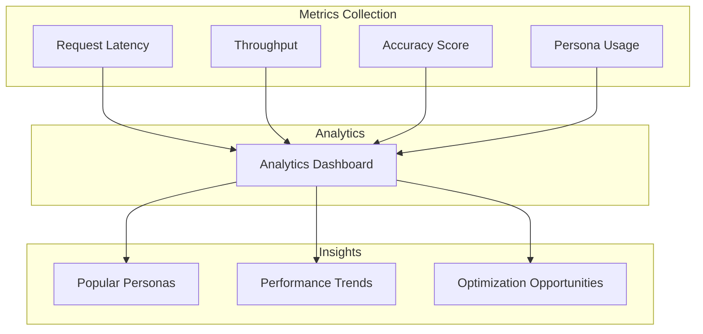

## Integration Points

### With PersonaManager

```mermaid
graph LR
    Engine[RecommendationEngine] --> Manager[PersonaManager]
    Manager --> Personas[getAllPersonas()]
    Manager --> Single[getPersona(id)]
    Personas --> Engine
    Single --> Engine
```

### With MCP Tools

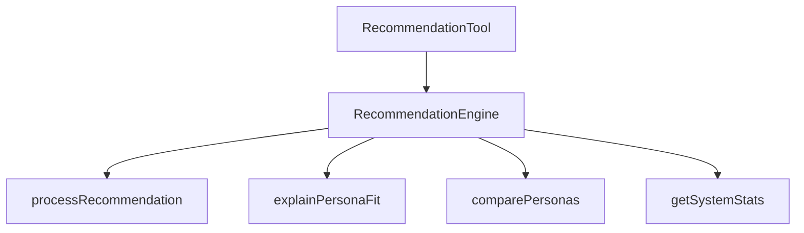

## Future Enhancements

1. **Machine Learning**
   - Learn optimal weights from feedback
   - Predict user preferences
   - Improve matching accuracy

2. **Advanced Analytics**
   - A/B testing framework
   - Recommendation effectiveness tracking
   - User behavior analysis

3. **Distributed Processing**
   - Microservice architecture
   - Horizontal scaling
   - Queue-based processing

4. **Real-time Updates**
   - WebSocket support
   - Live score updates
   - Dynamic weight adjustment
