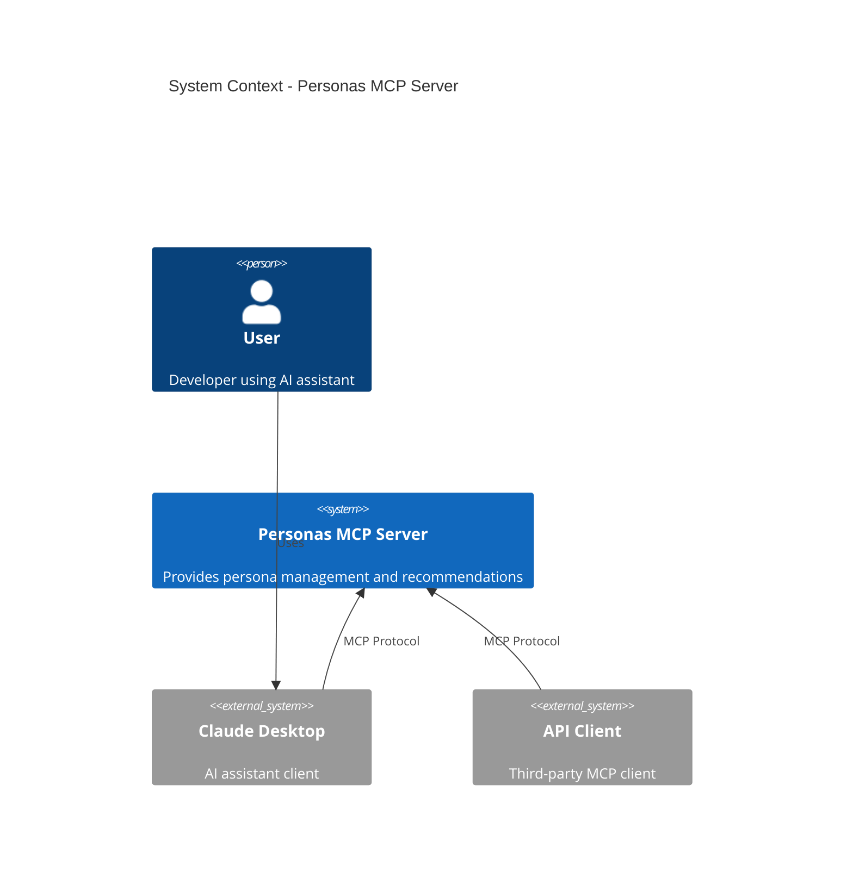
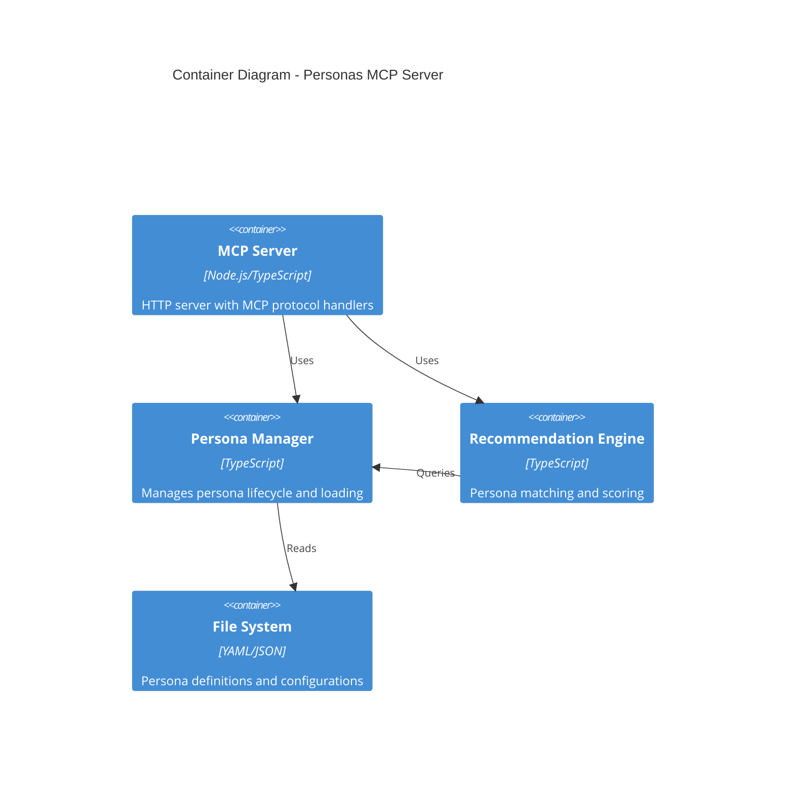
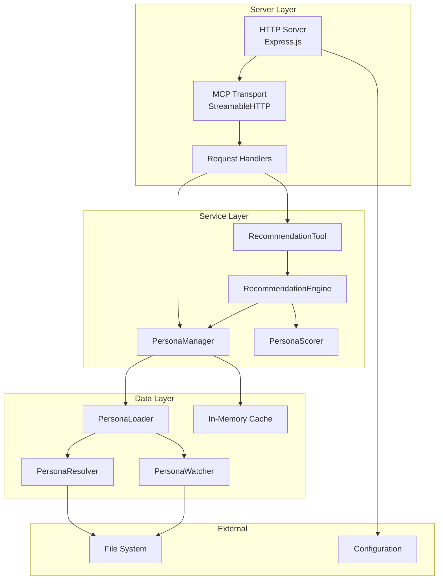
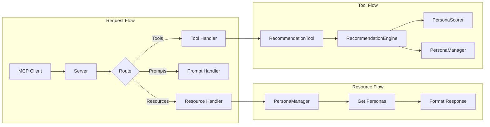
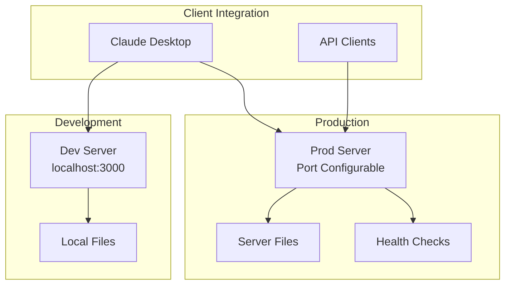
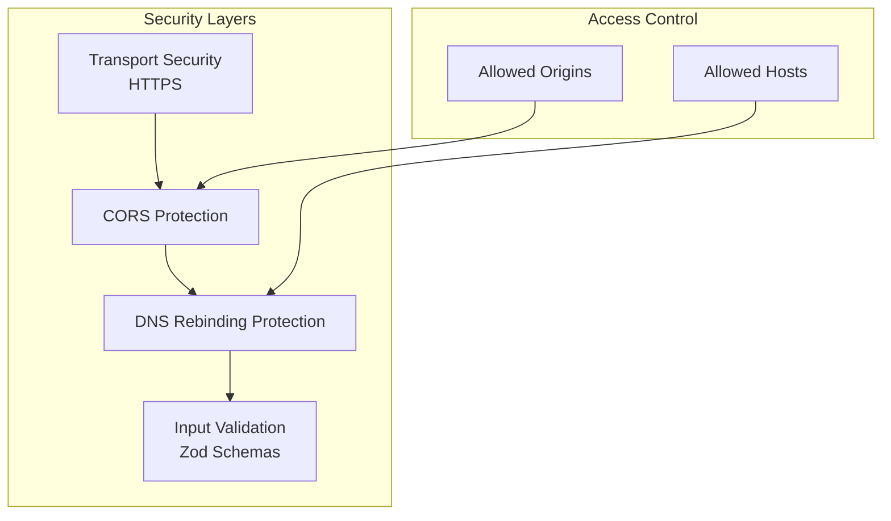

# System Architecture Overview

## Introduction

The Personas MCP Server is a Model Context Protocol server that provides AI assistants with specialized personas for improved problem-solving in software development tasks. This document provides a high-level overview of the system architecture.

## System Context

## Container Architecture

## Component Architecture

## Key Components

### 1. Server Layer
- **HTTP Server**: Express-based server handling HTTP requests
- **MCP Transport**: Handles MCP protocol communication
- **Request Handlers**: Route MCP requests to appropriate services

### 2. Service Layer
- **PersonaManager**: Central service for persona operations
- **RecommendationEngine**: Processes recommendation requests
- **PersonaScorer**: Implements scoring algorithm
- **RecommendationTool**: MCP tool interface for recommendations

### 3. Data Layer
- **PersonaLoader**: Loads personas from various sources
- **PersonaResolver**: Resolves persona conflicts and precedence
- **PersonaWatcher**: Monitors file changes for hot-reload
- **Cache**: In-memory storage for performance

## Data Flow

## Deployment Architecture

## Technology Stack

### Core Technologies
- **Runtime**: Node.js 18+
- **Language**: TypeScript 5.x
- **Framework**: Express.js
- **Protocol**: Model Context Protocol (MCP)

### Key Libraries
- **@modelcontextprotocol/sdk**: MCP protocol implementation
- **Zod**: Runtime type validation
- **Express**: HTTP server framework
- **tsx**: TypeScript execution
- **tsup**: Build tool

### Development Tools
- **Vitest**: Testing framework
- **ESLint**: Code linting
- **Prettier**: Code formatting
- **Husky**: Git hooks

## Design Principles

### 1. Modularity
- Clear separation of concerns
- Pluggable components
- Interface-based design

### 2. Extensibility
- Easy to add new personas
- Configurable scoring algorithms
- Plugin architecture for future features

### 3. Performance
- In-memory caching
- Lazy loading
- Efficient scoring algorithms

### 4. Reliability
- Comprehensive error handling
- Graceful degradation
- Health monitoring

## Security Architecture

## Scalability Considerations

### Horizontal Scaling
- Stateless server design
- No shared state between instances
- Load balancer compatible

### Vertical Scaling
- Efficient memory usage
- Optimized algorithms
- Resource pooling

## Monitoring & Observability

### Health Endpoints
- `/health` - System health status
- `/ready` - Service readiness
- `/` - Server information

### Metrics
- Request count and latency
- Persona usage statistics
- Recommendation accuracy

## Future Architecture Evolution

### Phase 1: Current
- Basic MCP server
- File-based personas
- Simple scoring

### Phase 2: Enhanced
- Database integration
- Advanced scoring
- Caching layer

### Phase 3: Advanced
- Machine learning integration
- Distributed architecture
- Real-time updates