# MCP Integration Design

## Overview

This document describes how the Personas MCP Server integrates with the Model Context Protocol (MCP) to provide persona management and recommendation capabilities.

## MCP Architecture

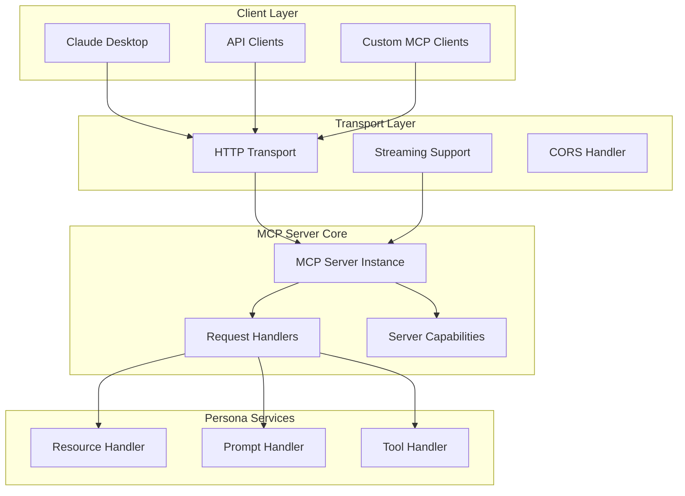

## Protocol Implementation

### Server Initialization

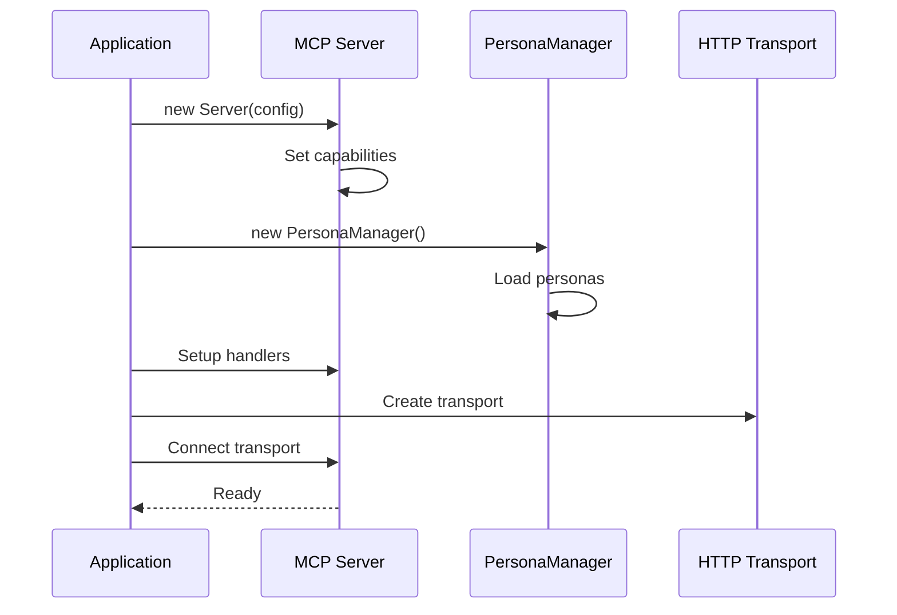

### Capability Registration

```mermaid
graph LR
    subgraph "Server Capabilities"
        Resources[resources: {}]
        Prompts[prompts: {}]
        Tools[tools: {}]
    end
    
    subgraph "Handler Registration"
        ListResources[ListResourcesRequest]
        ReadResource[ReadResourceRequest]
        ListPrompts[ListPromptsRequest]
        GetPrompt[GetPromptRequest]
        ListTools[ListToolsRequest]
        CallTool[CallToolRequest]
    end
    
    Resources --> ListResources
    Resources --> ReadResource
    Prompts --> ListPrompts
    Prompts --> GetPrompt
    Tools --> ListTools
    Tools --> CallTool
```

## Request Handling

### Resource Requests

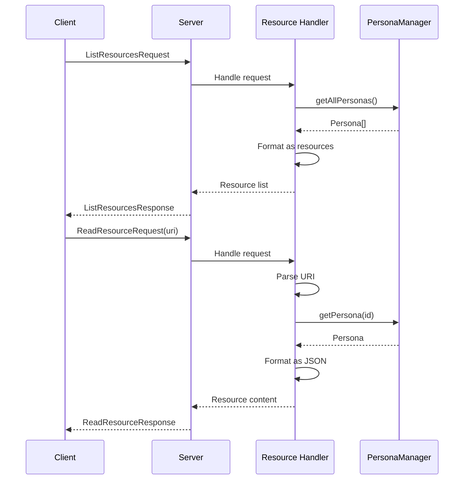

### Tool Requests

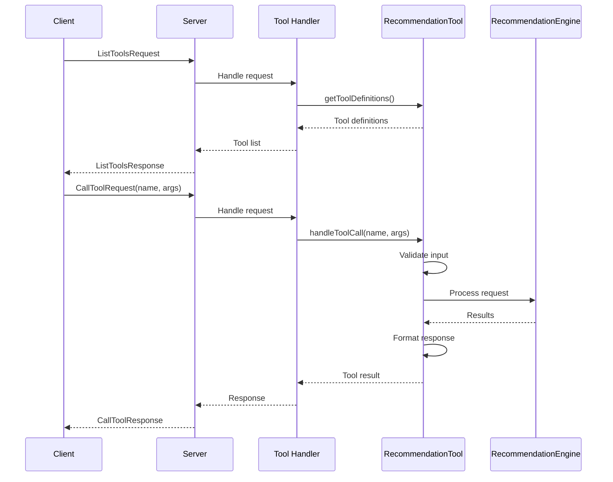

## Transport Layer

### HTTP Transport Configuration

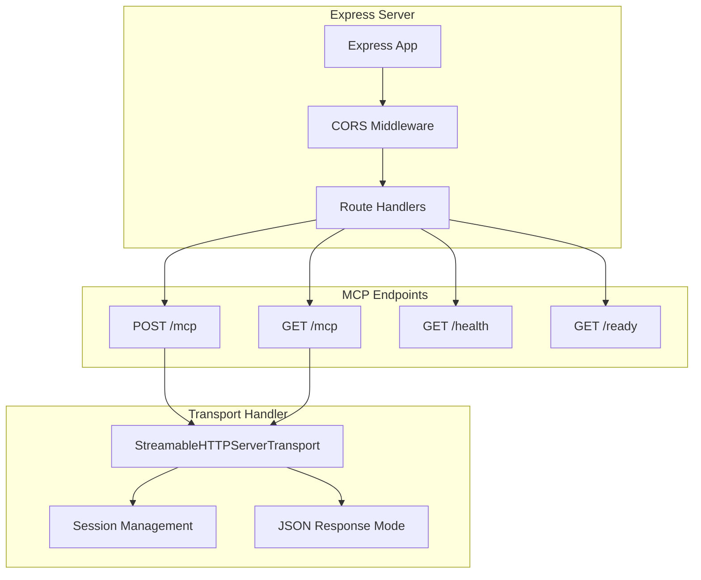

### Request/Response Flow

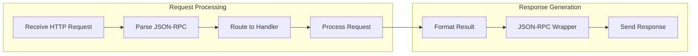

## Error Handling

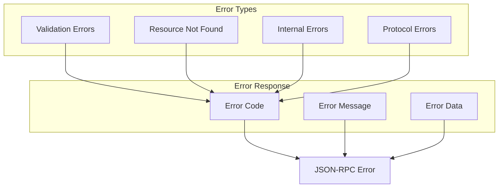

## Tool Integration Pattern

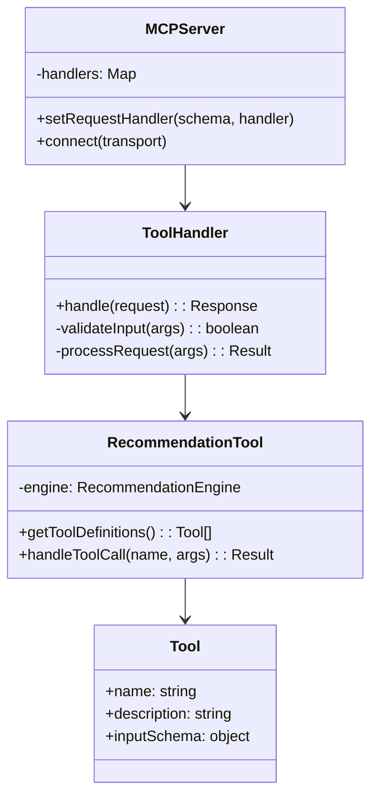

## Data Flow Through MCP

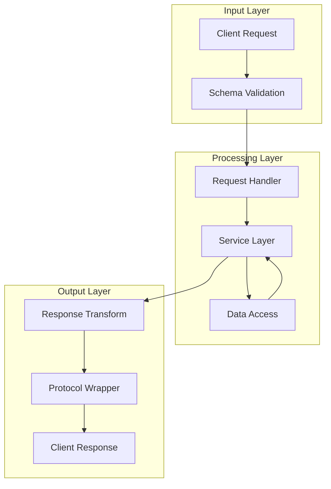

## Session Management

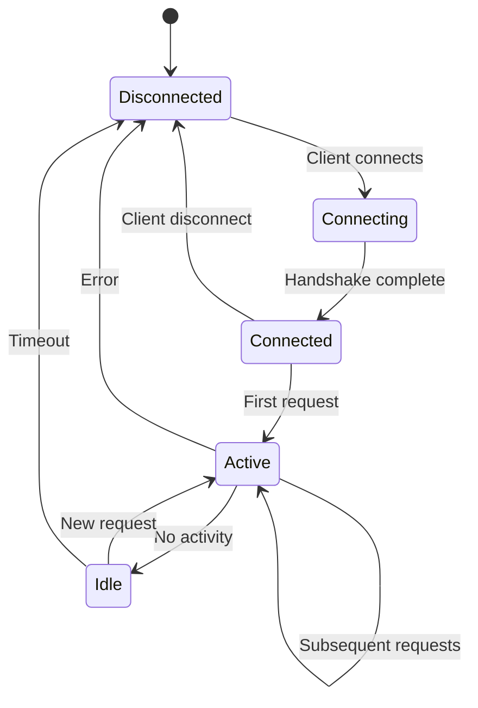

## Security Considerations

### DNS Rebinding Protection
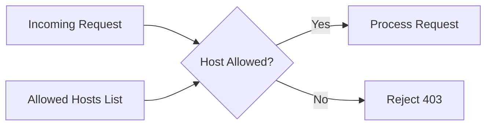

### CORS Configuration
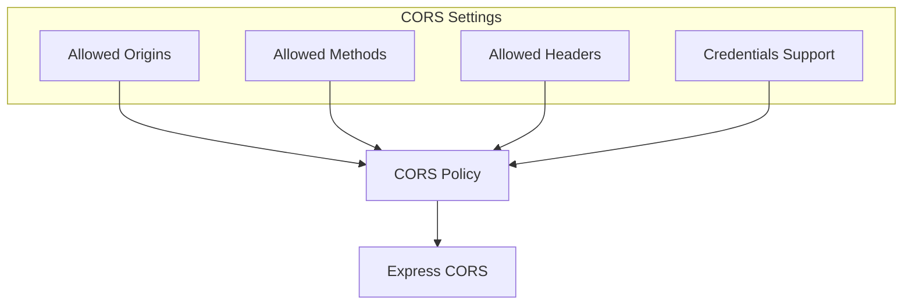

## Performance Optimizations

1. **Connection Pooling**: Reuse transport connections
2. **Response Caching**: Cache resource listings
3. **Lazy Loading**: Load personas on demand
4. **Streaming**: Use streaming for large responses

## Future Enhancements

1. **WebSocket Transport**: Real-time updates
2. **Authentication**: Token-based auth
3. **Rate Limiting**: Prevent abuse
4. **Metrics Collection**: Usage analytics