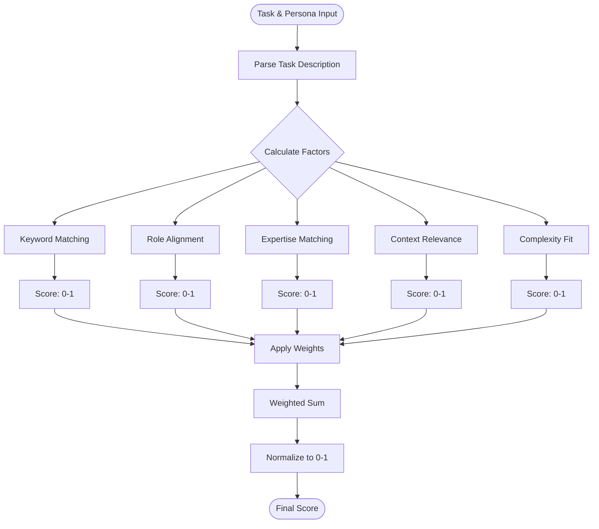
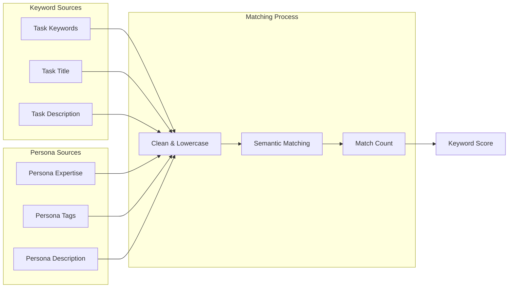
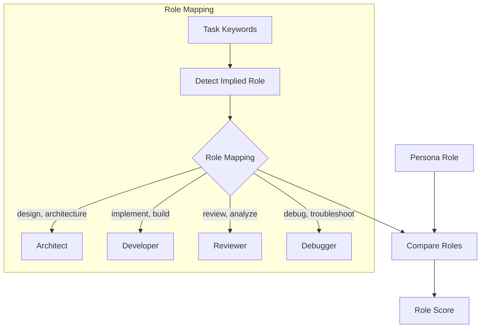
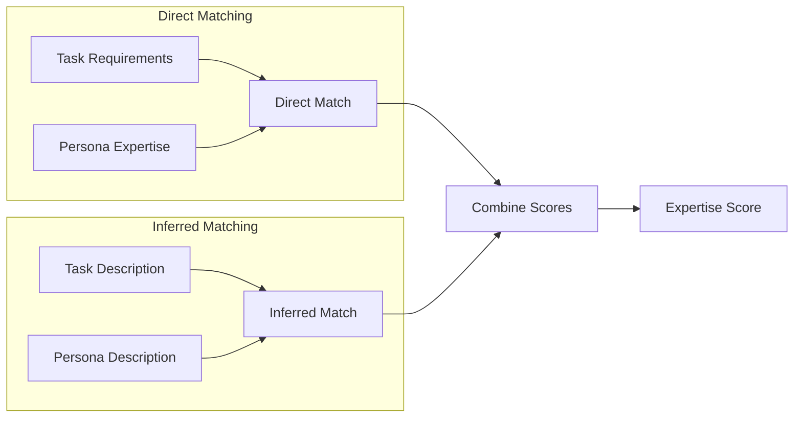
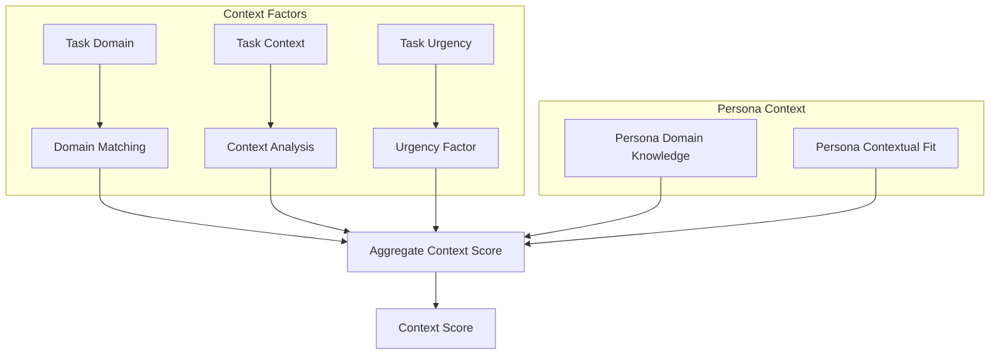
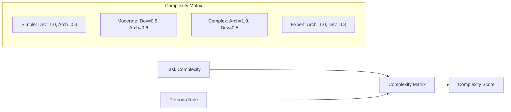
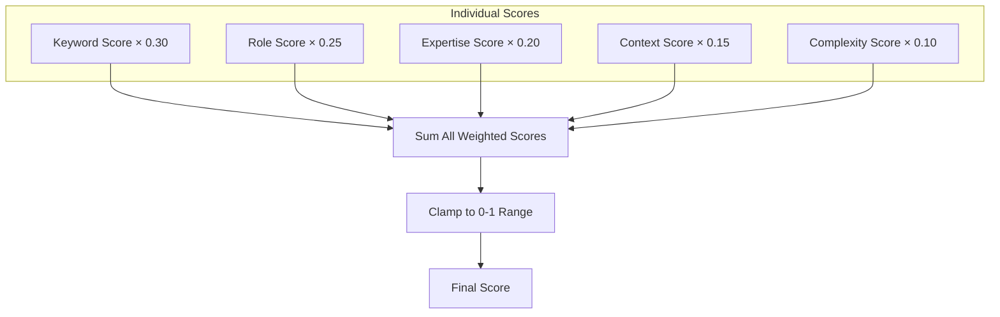
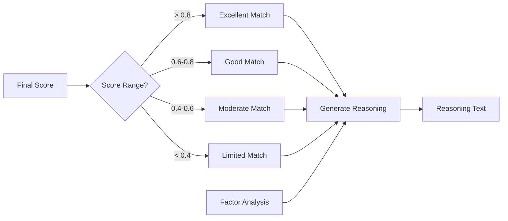
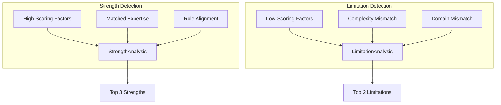

# Persona Scoring Algorithm Design

## Overview

The persona scoring algorithm is a multi-factor system that evaluates how well a persona matches a given task. It produces a normalized score between 0 and 1, with 1 being a perfect match.

## Algorithm Flow



## Factor Calculations

### 1. Keyword Matching (30% weight)



**Algorithm**:
```typescript
function calculateKeywordMatch(persona, task) {
  const taskKeywords = extractKeywords(task);
  const personaKeywords = extractKeywords(persona);
  
  let matches = 0;
  for (const taskKeyword of taskKeywords) {
    for (const personaKeyword of personaKeywords) {
      if (semanticMatch(taskKeyword, personaKeyword)) {
        matches++;
      }
    }
  }
  
  return normalize(matches, taskKeywords.length);
}
```

### 2. Role Alignment (25% weight)



**Scoring Matrix**:
| Task Implies | Architect | Developer | Reviewer | Debugger |
|-------------|-----------|-----------|----------|----------|
| Architecture| 1.0       | 0.4       | 0.6      | 0.3      |
| Development | 0.4       | 1.0       | 0.5      | 0.6      |
| Review      | 0.6       | 0.5       | 1.0      | 0.4      |
| Debugging   | 0.3       | 0.6       | 0.4      | 1.0      |

### 3. Expertise Matching (20% weight)



### 4. Context Relevance (15% weight)



### 5. Complexity Fit (10% weight)



## Score Aggregation



## Reasoning Generation



## Strengths & Limitations Identification



## Implementation Details

### Semantic Matching
The algorithm uses fuzzy string matching for keywords:
- Exact matches: 1.0 score
- Substring matches: 0.7 score
- Related terms: 0.5 score (e.g., "build" ↔ "implement")

### Normalization
All individual factors are normalized to 0-1 range:
```typescript
normalize(value, max) = Math.min(1, value / max)
```

### Weight Distribution
Default weights sum to 1.0:
- Keyword: 0.30
- Role: 0.25
- Expertise: 0.20
- Context: 0.15
- Complexity: 0.10

### Confidence Calculation
Confidence is based on:
- Number of factors with data: More data = higher confidence
- Score distribution: Extreme scores (very high/low) = higher confidence
- Match quality: Clear matches = higher confidence

## Performance Considerations

1. **Caching**: Keyword extraction cached per request
2. **Early Exit**: Skip detailed calculation if role mismatch > threshold
3. **Parallel Processing**: Calculate factors concurrently
4. **Memoization**: Cache semantic matching results

## Future Enhancements

1. **Machine Learning**: Train weights based on user feedback
2. **NLP Enhancement**: Better semantic understanding
3. **Domain Ontology**: Structured domain knowledge
4. **Collaborative Filtering**: Learn from similar task patterns