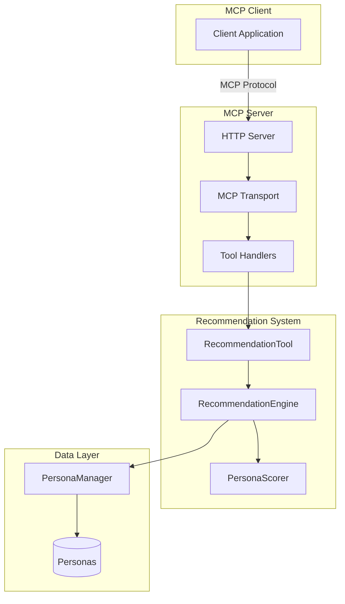
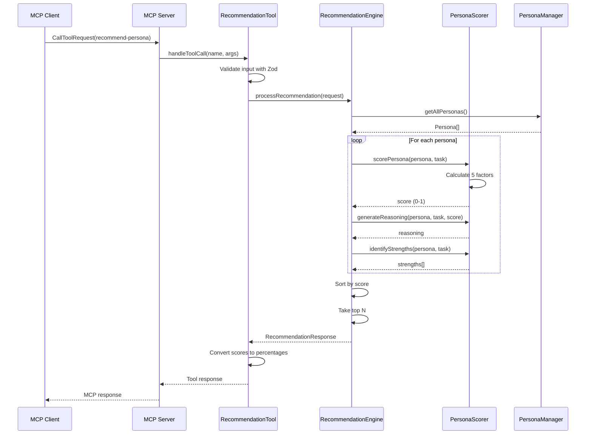
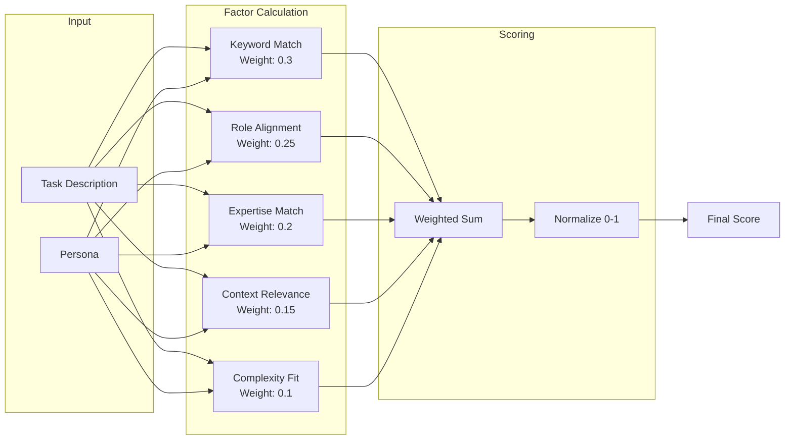
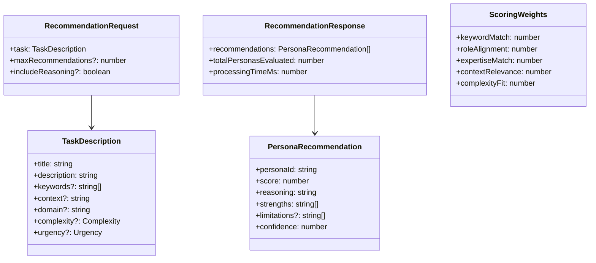

# Persona Recommendation System Design

## Overview

The Persona Recommendation System helps users find the most suitable personas for their software development tasks through intelligent matching based on multiple factors.

## System Architecture



## Request Flow



## Scoring Algorithm



## Data Model



## Scoring Factors Detail

### 1. Keyword Match (30%)
- Semantic matching between task keywords and persona expertise/tags
- Case-insensitive comparison
- Partial matches considered

### 2. Role Alignment (25%)
- How well the persona's role matches the task type
- Mapping of keywords to roles (e.g., "design" → architect)

### 3. Expertise Match (20%)
- Direct matching of task requirements to persona expertise
- Considers both explicit expertise and implicit from description

### 4. Context Relevance (15%)
- Domain matching (backend, frontend, etc.)
- Environmental context consideration

### 5. Complexity Fit (10%)
- Matches task complexity to persona capability
- Architects for complex/expert tasks
- Developers for simple/moderate tasks

## MCP Tools

### 1. recommend-persona
Find the best personas for your task based on description, keywords, and complexity.

**Input Schema**:
```json
{
  "name": "recommend-persona",
  "arguments": {
    "title": "Design a REST API",
    "description": "Create a RESTful API with authentication and rate limiting",
    "keywords": ["api", "rest", "authentication"],
    "complexity": "moderate"
  }
}
```

**Parameters**:
- `title` (required): Brief task title
- `description` (optional): Detailed task description
- `keywords` (optional): Array of relevant keywords
- `complexity` (optional): "simple" | "moderate" | "complex" | "expert"
- `context` (optional): Additional context or constraints
- `domain` (optional): Technical domain (backend, frontend, etc.)

**Output Example**:
```json
{
  "recommendations": [
    {
      "personaId": "architect",
      "score": 95,
      "reasoning": "Strong match for API design with focus on architecture",
      "strengths": ["API design patterns", "Authentication architecture", "Scalability"],
      "confidence": 0.95
    },
    {
      "personaId": "developer",
      "score": 78,
      "reasoning": "Good for implementation details",
      "strengths": ["Code implementation", "REST best practices"],
      "confidence": 0.78
    }
  ]
}
```

### 2. explain-persona-fit
Get a detailed explanation of why a specific persona fits (or doesn't fit) your task.

**Input Schema**:
```json
{
  "name": "explain-persona-fit",
  "arguments": {
    "personaId": "architect",
    "title": "System design",
    "description": "Design a distributed system"
  }
}
```

**Parameters**:
- `personaId` (required): The persona ID to analyze
- `title` (required): Task title
- `description` (optional): Task details
- `keywords` (optional): Relevant keywords

**Output Example**:
```json
{
  "personaId": "architect",
  "overallScore": 92,
  "scoreBreakdown": {
    "keywordMatch": 0.9,
    "roleAlignment": 0.95,
    "expertiseMatch": 0.88,
    "contextRelevance": 0.92,
    "complexityFit": 0.95
  },
  "analysis": {
    "strengths": [
      "Perfect role alignment for system design",
      "Deep expertise in distributed systems",
      "Handles complex architectural decisions"
    ],
    "limitations": [
      "Less focused on implementation details",
      "May over-engineer for simple tasks"
    ],
    "recommendation": "Highly recommended for this task"
  }
}
```

### 3. compare-personas
Compare multiple personas side-by-side for the same task.

**Input Schema**:
```json
{
  "name": "compare-personas",
  "arguments": {
    "personaIds": ["architect", "developer"],
    "title": "API design",
    "description": "Design and implement a new API"
  }
}
```

**Parameters**:
- `personaIds` (required): Array of persona IDs to compare (2-4 recommended)
- `title` (required): Task title
- `description` (optional): Task details
- `keywords` (optional): Relevant keywords

**Output Example**:
```json
{
  "comparison": {
    "architect": {
      "score": 88,
      "strengths": ["High-level design", "Scalability", "Standards"],
      "weaknesses": ["Implementation details"],
      "bestFor": "Initial design and architecture decisions"
    },
    "developer": {
      "score": 82,
      "strengths": ["Implementation", "Code quality", "Practical solutions"],
      "weaknesses": ["May miss architectural concerns"],
      "bestFor": "Writing the actual code"
    }
  },
  "recommendation": "Start with architect for design, then switch to developer for implementation",
  "synergyScore": 0.94
}
```

### 4. get-recommendation-stats
Get system statistics and scoring configuration.

**Input Schema**:
```json
{
  "name": "get-recommendation-stats",
  "arguments": {}
}
```

**Output Example**:
```json
{
  "systemStats": {
    "totalPersonas": 12,
    "customPersonas": 3,
    "totalRecommendations": 156,
    "averageScore": 78.5
  },
  "scoringWeights": {
    "keywordMatch": 0.3,
    "roleAlignment": 0.25,
    "expertiseMatch": 0.2,
    "contextRelevance": 0.15,
    "complexityFit": 0.1
  },
  "popularPersonas": [
    {"id": "developer", "usageCount": 45},
    {"id": "architect", "usageCount": 38},
    {"id": "debugger", "usageCount": 32}
  ]
}
```

## Design Decisions

### Why Multi-Factor Scoring?
Single-factor matching (e.g., just keywords) misses nuanced requirements. Multi-factor scoring provides more accurate recommendations by considering different aspects of the task-persona fit.

### Why Weighted Scoring?
Different factors have different importance. Keywords and role alignment are generally more important than complexity matching, hence higher weights.

### Why 0-1 Normalization?
Provides consistent score interpretation across all factors and makes percentage conversion straightforward for user presentation.

## Future Enhancements

1. **Machine Learning Integration**: Learn optimal weights from user feedback
2. **Dynamic Weight Adjustment**: Allow users to customize scoring weights
3. **Persona Combinations**: Recommend teams of personas for complex projects
4. **Historical Analysis**: Track recommendation effectiveness over time