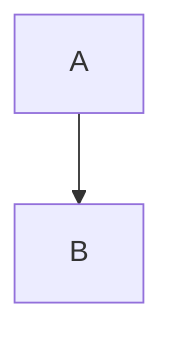
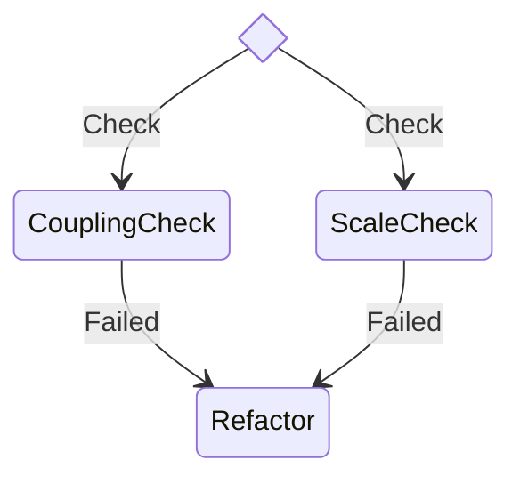

# Mermaid Diagram Validation Process

This document describes the process for validating Mermaid diagrams in persona documentation to ensure they render correctly.

## Background

Mermaid diagrams are used extensively in persona documentation to visualize workflows, decision trees, and processes. These diagrams must be syntactically correct to render properly in documentation viewers.

## Validation Script

A validation script is available at `scripts/validate-mermaid.js` that:

1. Extracts all Mermaid diagrams from markdown files
2. Validates each diagram using the Mermaid CLI
3. Reports any syntax errors with line numbers

### Usage

```bash
# Validate all markdown files in a directory
node scripts/validate-mermaid.js docs/personas/

# Validate a specific markdown file
node scripts/validate-mermaid.js docs/personas/architect.md

# Validate all docs (from project root)
node scripts/validate-mermaid.js docs/
```

## Common Issues and Solutions

### 1. Indentation in Diagrams

**Issue**: Mermaid diagrams copied from TypeScript source files often have indentation that can cause parsing issues.

**Solution**: Remove all leading whitespace from diagram lines. The diagram should be flush-left within the code block.

```markdown
❌ Bad:


✅ Good:

```

### 2. State Diagram Choice Syntax

**Issue**: The `<<choice>>` syntax in state diagrams can cause parsing conflicts when the same state names appear in multiple transitions.

**Solution**: Use unique state names throughout the diagram while preserving the choice notation and transition labels.

```markdown
❌ Bad (causes parser conflict):
```mermaid
stateDiagram-v2
state Validate <<choice>>
Validate --> Coupling: Check
Validate --> Scale: Check
Coupling --> Refactor: Failed
Scale --> Refactor: Failed
```

✅ Good (preserves semantics with unique names):

```

### 3. Missing Blank Lines

**Issue**: Some Markdown renderers require blank lines before and after code blocks.

**Solution**: Always include blank lines around Mermaid code blocks.

## Documentation Process for Personas

When documenting personas with Mermaid diagrams:

1. **Extract diagrams from TypeScript source**
   - Copy the `mermaidDSL` content from the persona's `behaviorDiagrams` array

2. **Format the diagram**
   - Remove all leading indentation
   - Ensure diagram content is flush-left
   - Add blank lines before and after the code block

3. **Validate before committing**
   ```bash
   node scripts/validate-mermaid.js docs/personas/new-persona.md
   ```

4. **Fix any reported errors**
   - Check line numbers reported by the validator
   - Apply solutions from the common issues section
   - Re-validate until all diagrams pass

5. **Test rendering**
   - Preview the markdown file to ensure diagrams render correctly
   - Check that diagram titles and descriptions are properly formatted

## Example Workflow

```bash
# 1. Create new persona documentation
vim docs/personas/new-persona.md

# 2. Add content including Mermaid diagrams

# 3. Validate the diagrams
node scripts/validate-mermaid.js docs/personas/new-persona.md

# 4. Fix any errors and re-validate

# 5. Commit when all validations pass
git add docs/personas/new-persona.md
git commit -m "docs: add new persona documentation"
```

## Troubleshooting

If validation fails but the error message is unclear:

1. Create a temporary `.mmd` file with just the problematic diagram
2. Run Mermaid CLI directly for more detailed error messages:
   ```bash
   npx @mermaid-js/mermaid-cli -i test.mmd -o test.svg
   ```
3. Check the Mermaid documentation for syntax requirements
4. Simplify the diagram step by step to isolate the issue

## Future Improvements

- Add pre-commit hook to automatically validate Mermaid diagrams
- Integrate validation into the build process
- Create a GitHub Action for PR validation
- Add support for automatic diagram formatting